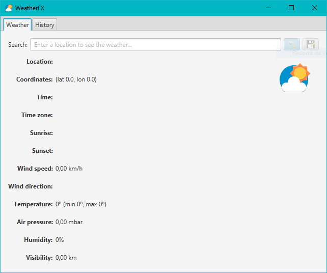
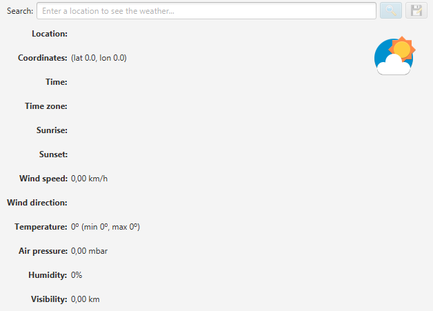
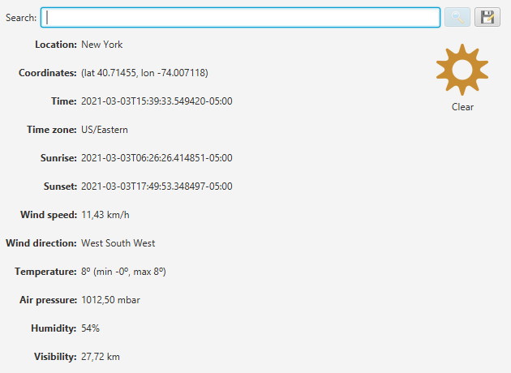
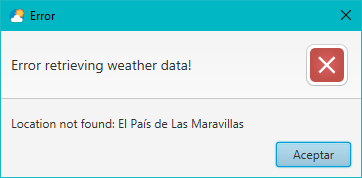
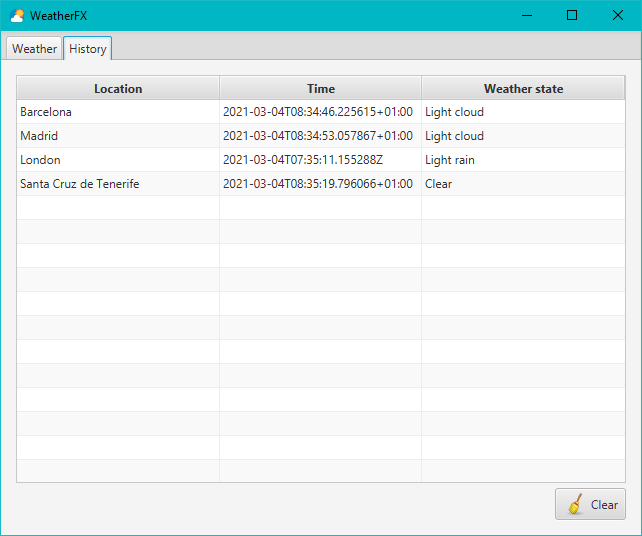

# WeatherFX
Examen del módulo profesional **Desarrollo de Interfaces**.

## Descripción

Implementar una aplicación con GUI empleando el framework JavaFX que permita el **consultar el estado del tiempo para la ubicación especificada**. 

Se deberá aplicar el patrón de diseño **MVC (Modelo-Vista-Controlador)**, y las vistas deberán implementarse en FXML.

Además, la interfaz deberá ser **responsive**.

## WeatherService

Se dispone de la clase `WeatherService` cuyo método `getWeather(String location)` devuelve la información del tiempo (objeto de tipo `Weather`) para la ubicación indicada. 

Los miembros de la clase `Weather` son los siguientes:

- **Weather**: Información del tiempo.
  - **location**: Nombre de la ubicación devuelva por el servicio.
  - **longitude**: Longitud de la ubicación.
  - **latitude**: Latitud de la ubicación.
  - **time**: Fecha y hora actual (Zulu).
  - **timezone**: Zona horaria.
  - **sunrise**: Fecha y hora de la salida del sol (Zulu).
  - **sunset**: Fecha y hora de la puesta de sol (Zulu).
  - **state**: Estado del tiempo (ver enumerado **WeatherState**)
  - **stateIconUrl**: Dirección (URL) al icono del estado del tiempo.
  - **wind**: Información del viento (ver clase **Wind**).
  - **temperature**: Temperatura en grados centígrados (ºC).
  - **minTemperature**: Temperatura mínima en grados centígrados (ºC).
  - **maxTemperature**: Temperatura máxima en grados centígradps (ºC).
  - **airPressure**: Presión del aire en milibares (mbar).
  - **humidity**: Porcentaje de humedad (%).
  - **visibility**: Visibilidad en kilómetros (km).
- **WeatherState**: Enumerado con el estado del tiempo (Clear, Light rain, Thunderstorm, ...).
- **Wind**:
  - **speed**: Velocidad del viento (km/h).
  - **directionCompass**: Dirección del viento (ver enumerado **CompassPoint**).
- **CompassPoint**: Enumerado con la dirección del viento ([16-wind compass rose](https://upload.wikimedia.org/wikipedia/commons/thumb/1/1a/Brosen_windrose.svg/1024px-Brosen_windrose.svg.png)).

### Ejemplo de uso del servicio

El siguiente fragmento obtiene la información del tiempo en Santa Cruz de Tenerife y la muestra en consola:

 ```java
Weather weather = WeatherService.getWeather("Santa Cruz de Tenerife");
System.out.println(weather);
 ```

Resultado:

```
Weather [
	location=Santa Cruz de Tenerife, 
	latitude=28.46163, 
	longitude=-16.267059, 
	time=2021-03-04T08:24:59.257634+01:00, 
	sunrise=2021-03-04T08:26:41.867255+01:00, 
	sunset=2021-03-04T20:07:07.142627+01:00, 
	timeZone=Europe/Madrid, 
	state=Clear, 
	stateIconUrl=https://www.metaweather.com/static/img/weather/png/64/c.png, 
	wind=Wind [speed=11.313242601037938,directionCompass=North], 
	temperature=17.92, 
	minTemperature=14.675, 
	maxTemperature=19.46, 
	airPressure=1022.0, 
	humidity=70, 
	visibility=16.092960001093612
]
```

## Interfaz de la aplicación

- Al iniciar la aplicación se deberá abrir la ventana de la aplicación, que deberá tener el siguiente aspecto: 

  

> **Todos los márgenes y espaciados entre componentes será como mínimo de 5 píxeles.**

### Pestaña "Weather"

- Desde esta pestaña se podrá consultar la información del tiempo:

  
  
   

#### Consultar el tiempo

- Introducir una ubicación para consultar el tiempo en el campo **Search** y pulsar el botón **Buscar** ().

- Se cargarán los datos en las etiquetas tal y como se muestra a continuación:

  

- El botón de **Buscar** se habilitará sólo si se ha introducido algo en el campo **Search**.

- Si la consulta del tiempo ha sido exitosa, se vaciará el campo **Search**.

- En caso de que `WeatherService` devuelva un error, se mostrará el siguiente mensaje:



- El encabezado de la alerta siempre será el mismo y el contenido será el mensaje de la excepción.

#### Guardar en el histórico

- Una vez se ha consultado el tiempo de una ubicación, se podrá guardar en el histórico mediante el botón **Guardar** ().
- El botón se habilitará al realizar la primera búsqueda.
- Consultar **Pestaña "History"** para saber más.

### Pestaña "History"

- Desde esta pestaña se podrá consultar el historial de consultas del tiempo guardadas:



- Sólo será necesario guardar la ubicación (**Location**), la fecha y hora de la consulta (**Time**) y el estado del tiempo (**Weather state**).

#### Limpiar el historial

- El botón **Clear** () vaciará el historial. 
- Si el historial está vacío, el botón **Clear** deberá deshabilitarse.

### Persistencia del historial

- Al cerrar la aplicación deberá guardarse el historial en el fichero `.WeatherFX` del perfil del usuario.
- Al abrir la aplicación deberá cargarse el historial desde el fichero `.WeatherFX` almacenado en el perfil del usuario.
- El formato del fichero será el que el alumno considere (TXT, CSV, JSON, XML, ...).

> Para obtener la ruta al perfil del usuario: 
>
> ```java
> System.getProperty("user.home")
> ```

## Criterios de calificación

| **Criterios**                                                | **Puntuación** |
| ------------------------------------------------------------ | -------------- |
| **Pestaña Weather**                                          | -              |
| Diseño (se ajusta a lo que se pide: iconos, negristas, ubicación de los elementos, bordes, espaciado, es responsive, ...). | 15             |
| Consultar tiempo (se habilita/deshabilita botón, se presentan los resultados en la vista). | 25             |
| Guardar en historial.                                        | 5              |
| **Pestaña  "History"**                                       | -              |
| Diseño (se ajusta a lo que se pide: iconos, negristas, ubicación de los elementos, bordes, espaciado, es responsive, ...). | 10             |
| Listar historial (se muestran los datos en la tabla).        | 15             |
| Limpiar el historial (se habilita/deshabilita botón).        | 10             |
| **Persistencia**                                             | -              |
| Se carga el historial al abrir la aplicación                 | 10             |
| Se guarda el historial al cerrar la aplicación               | 10             |
| **Total**                                                    | **100**        |

> **El profesor determinará el grado de cumplimiento de cada apartado a partir de la ejecución de la aplicación, por lo que es sumamente importante que los apartados que queremos que puntúen se puedan probar.** 
